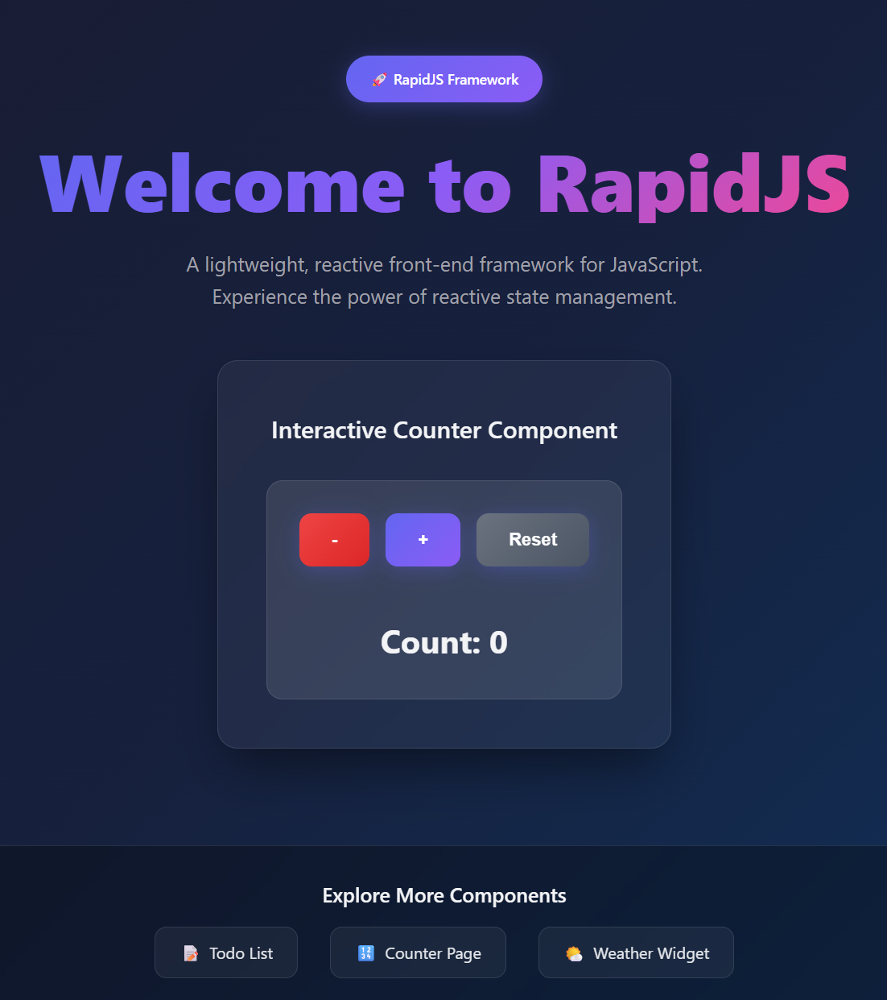
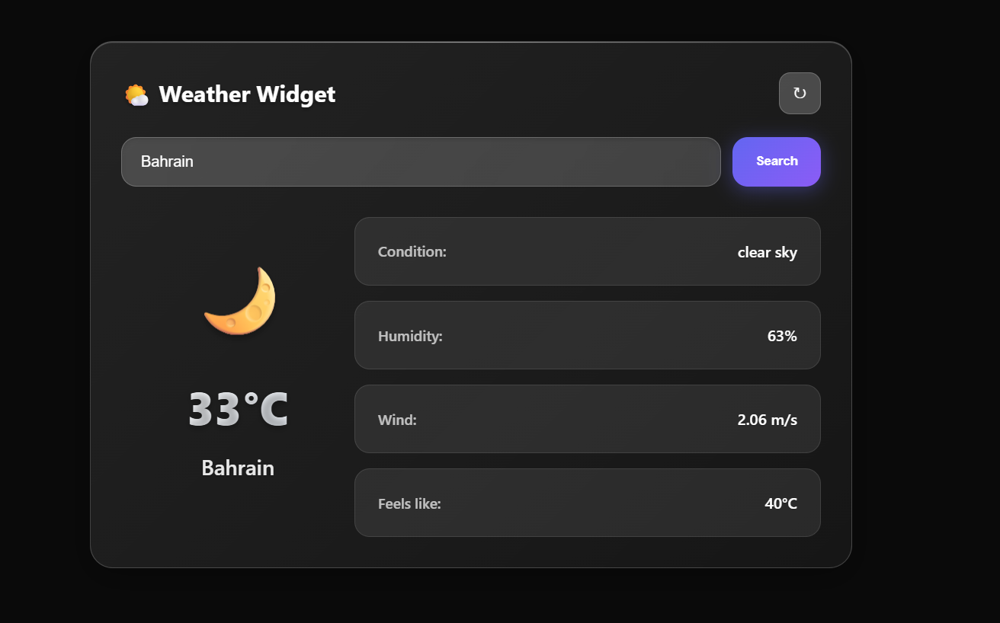

# RapidJS

RapidJS is a lightweight, reactive front-end framework for building modern web applications. It provides a simple and intuitive API for managing state, rendering components, and handling events.

[Visit in npmjs](https://www.npmjs.com/package/create-rapidjs-app)




---

## Features

- **Reactive State Management**: Use `useState` and `useRef` to manage reactive and non-reactive state.
- **Component-Based Architecture**: Build reusable components by extending the `Component` class.
- **Event Binding**: Use the `@` prefix to bind events directly in your templates.
- **Scoped Styles**: Load and scope CSS styles to specific components using `loadStyle`.
- **Nested Components**: Automatically inject `data-component-id` for nested components.
- **Routing**: Define routes and navigate between pages with ease.
- **Toast Notifications**: Built-in toast notification system for user feedback.

---

## Getting Started

### Prerequisites

- Node.js (v14 or higher)
- npm (Node Package Manager)

### Installation

1. set up the project 
    ```bash
    npx create-rapidjs-app my-app
    ```

2. change directory to the newly created project directory
   ```bash
   cd my-app
   ```

3. Start the development server:
   ```bash
   npm run dev
   ```

4. Open your browser and navigate to:
   ```
   http://localhost:3000
   ```

---

## Framework Concepts

### 1. **Components**

Components are the building blocks of a RapidJS application. Each component must:

- Extend the `Component` class.
- Implement a `constructor` and a `render()` method.
- Use `useState` or `useRef` for state management.

#### Example: Counter Component

The `Counter` component is a simple example of a reusable component in RapidJS. It demonstrates state management, event handling, and rendering.

```javascript
import { useState } from "../../src/variable.js";
import { Component } from "../../src/framework.js";

export class Counter extends Component {
  constructor() {
    super(); // This automatically assigns this.id and sets up Component features
    useState({ count: 0 }); // Reactive state
  }

  increment() {
    this.setCount(this.count() + 1);
  }

  decrement() {
    this.setCount(this.count() - 1);
  }

  reset() {
    this.setCount(0);
  }

  render() {
    return `
      <div class="counter-container">
        <div style="display: flex; gap: 1rem; justify-content: center; margin-bottom: 1.5rem;">
          <button class="counter-button" @click="decrement" style="background: linear-gradient(135deg, #ef4444 0%, #dc2626 100%);">-</button>
          <button class="counter-button" @click="increment">+</button>
          <button class="counter-button" @click="reset" style="background: linear-gradient(135deg, #6b7280 0%, #4b5563 100%);">Reset</button>
        </div>
        <p class="counter-display">Count: ${this.count()}</p>
      </div>
    `;
  }
}
```

---

### 2. **State Management**

#### `useState`

- Creates reactive state that triggers DOM updates when changed.
- Automatically links state to the current component.

```javascript
useState({ count: 0 });
this.count(); // Getter
this.setCount(10); // Setter
```

#### `useRef`

- Creates non-reactive state that does NOT trigger DOM updates.

```javascript
useRef({ inputValue: "" });
this.inputValue(); // Getter
this.setInputValue("Hello"); // Setter
```

---

### 3. **Event Binding**

Use the `@` prefix to bind events directly in your templates.
Parameters are support

```html
<button @click="increment()">Increment</button>
<input @input="handleInput()" />
```

---

### 4. **Routing**

Define routes using the `rapid()` API.

#### Example

```javascript
import { rapid } from "./src/framework.js";
import { Home } from "./app/Pages/HomePage/Home.js";
import { CounterPage } from "./app/Pages/CounterPage/CounterPage.js";

const app = rapid();
app.route('/', Home);
app.route('/counter', CounterPage);
app.start();
```

Navigate between routes using `rapid.navigateTo()`:

```javascript
rapid.navigateTo('/counter');
```

---

### 5. **Scoped Styles**

Use `loadStyle` to load and scope CSS styles to a specific component.

```javascript
import { loadStyle } from "../../src/framework.js";

loadStyle('./app/Components/Counter.css');
```

---

### 6. **Toast Notifications**

Use the `Toast` class to show notifications.

#### Example

```javascript
import { Toast } from "./app/Components/Toast/Toast.js";

Toast.success("Operation successful!");
Toast.error("Something went wrong!");
Toast.info("This is an info message.");
Toast.warning("This is a warning.");
```

---

## Troubleshooting

### Common Issues

1. **Uncaught SyntaxError: Unexpected token '<'**
   - Ensure you're running the development server `npm run dev`.

2. **Styles not applied**
   - Check the path in `loadStyle` and ensure the CSS file exists.

3. **Event not triggered**
   - Ensure the method name in the `@` binding matches the method in your component.

---

## License

This project is licensed under the MIT License. See the `LICENSE` file for details.

---

## Author

**Taha Aljamri**  
[GitHub](https://github.com/NOT-LT)
